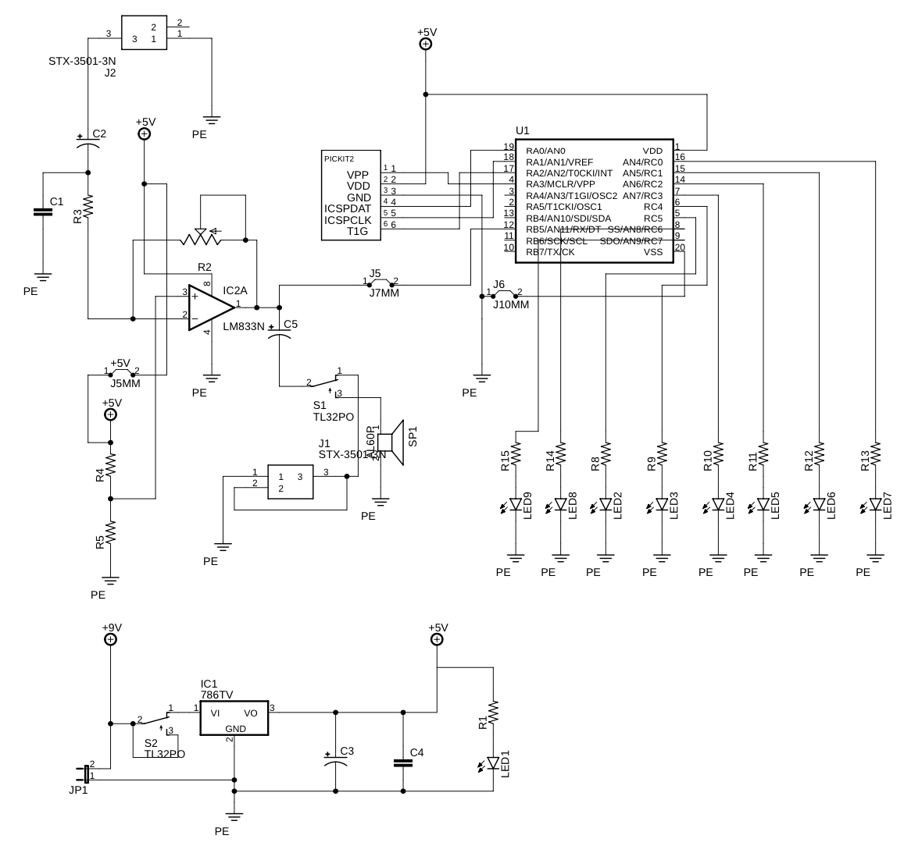
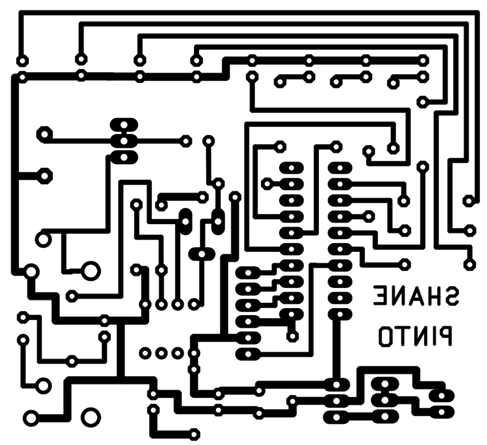
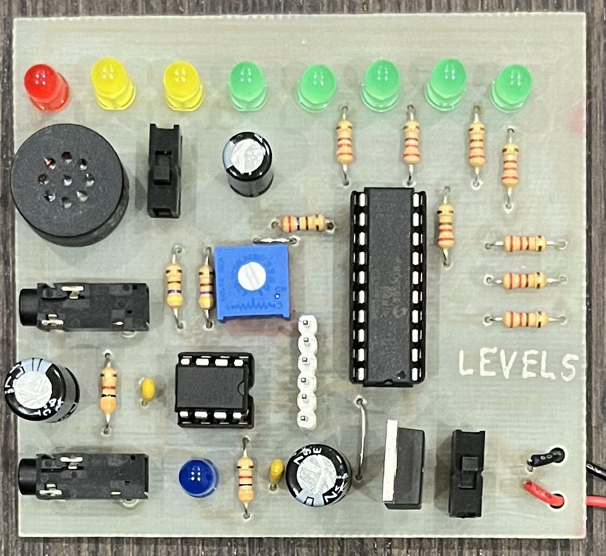

# Levels

Levels is an audio visualizer circuit board. When given audio signals as input, the board will display the magnitude of the sound on a row of LED lights.  The board is powered by a 9V battery and downsteps the voltage to 5V to power its components with an onboard voltage regulator. It supports audio input via an input AUX jack, and can output audio through either an output AUX jack, or a speaker.

## Circuit Components

### Amplification

The audio signal is inputted through the input AUX jack, and fed into the LM833N operational amplifier. The op amp is configured with set resistors and capacitors to amplify the incoming audio signals before they are sent to the output and the microcontroller. As to not cut off parts of audio signals, the op amp is raised to a virtual ground of 2.5V, rather than the IC's ground of 0V. A potentiometer is also part of this component of the circuit and can be used for tuning volume and clarity, as well as adjusting the sensitivity of the LED visualizer.

### Audio Processing

After amplification, the outputted audio signals are sent to the PIC16F690 microcontroller. A set of 6 sip pins on the board allow for a PicKit programmer to be connected to the board for reprogramming the PIC. Running on the microcontroller is an assembly program which determines the magnitude of the audio signal and turns on the appropriate number of LEDs. The internal ADCON register on the PIC manages the storing of sampled values of the audio signal. The read analog value is converted and stored in the ADRESL and ADRESH registers. After these registers are read, and a value representing the magnitude of the audio signal is obtained, the program decides which LEDs to turn on to represent the volume of the audio by writing bits to the PORTC register which the LEDs are connected to.

### Audio Output

The audio signals outputted by the amplifier are also routed to the output AUX jack and the speaker. A switch on the board controls which of the two components the audio signals are sent to. The speaker will play the audio directly from the board. The output AUX jack allows for headphones, or a small speaker to be connected to the board so that the audio can be played through an external device. Since the output volume can be different between the speaker and devices connected to the output jack, the potentiometer can be used to adjust the volume of the audio. Alternatively, the volume may be adjusted using the device which is playing the audio.

## Schematic

## Circuit Board

### Trace Mask

### Finished Circuit Board
